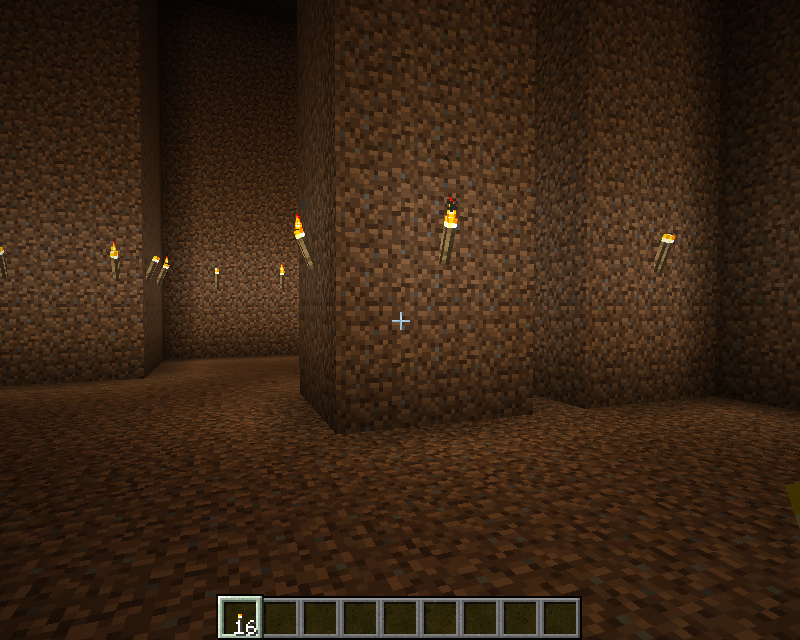

# CoalaMC_Example1
주어진 공간에 방을 만드는 예제입니다. 이 프로그램으로 다음과 같이 던전을 만들 수 있습니다.


# 프로그램 실행하기
1. 월드 생성하기: 월드를 생성할 때, Superflat으로 DIRT 블록을 98개 포함하도록 합니다.
```
PRESET: (3;minecraft:bedrock,**98***minecraft:dirt,minecraft:grass;1;village)
```
2. 프로그램을 빌드하고 실행하기: 다음 값을 입력해서 방을 생성한다.
```
실행1: 5 30 10 15 40 15
실행2: 0 30 4 8 40 13
실행3: 12 30 4 12 40 13
실행4: 6 30 0 14 40 6
```
3. 마인크래프트에서 던전을 확인한다.
```
/tp 10 30 14 
```

# 동영상

